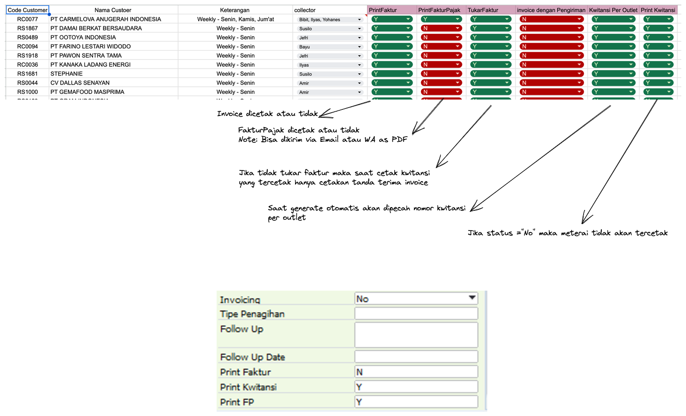

# Perbaikan Sistem AR - Invoice


## Sebelum


### ALUR 


 

**[1] Invoice**

* Membuat invoice berdasarkan dokumen yang diberikan dari bagian admin
* setelah selesai, bagian invoice akan print dokumen tersebut untuk digabungkan dengan dokumen lain ( PO, DO)
  
    * _jika status print invoice aktif_

**[2] Admin**


* Cek kelengkapan invoice (DO PO)
* Validasi dengan update status didalam ```sistem```  ( _Invoice checklist_ )


**[3] Admin Kwitansi**

* Menerima dokumen invoice
* Print Faktur Pajak jika diperlukan customer
* Mengelompokkan invoice yang diterima berdasarkan jadwal dari AR

**[4] Kwitansi**


* Menerima dokumen dari bagian admin, kemudian membuat kwitansi dan cetak
* Kemudian diserahkan ke bagian admin kwitansi ```(5)```


**[5] Admin Kwitansi**


* Cek di list kwitansi kelengkapan dokumen
* stempel dan pasang meterai


**[6]  Kwitansi**


* TTd Kwitansi
* paraf di list kwitansi
* bagikan ke bagian ```AR```


---
## Perbaikannya
---

### ALUR  

**AR**

* Membuat jadwal tukar faktur per customer disertai keterangan syarat tukar faktur (```CNW-BP```)
* Memasukkan nama kolektor per customer
* _Men-setting aturan cetak kwitansi, invoice , dan faktur pajak_ per customer
  * Status print invoice ( Y / N )
  * Status print Faktur pajak ( Y / N )
  * Status print kwitansi ( Y / N)
  * _```Status Cetakan Kwitansi ( per Code Customer / Per Outlet )```_



**Admin DO**

* Menerima dokumen DO dari bagian admin gudang
* cek semua kelengkapan dokumen untuk syarat tagih ( berdasarkan ```jadwal tukarfaktur```)
* Check list di sistem kelengkapan tersebut (```cnw-dolist```)
* Input dan atau ___Upload Nomor GR dari customer (DO asli)___ ke system (```cnw-dolist```)


**[1] Invoice**


* Membuat invoice berdasarkan dokumen yang diberikan dari bagian admin
* setelah selesai, bagian invoice akan print dokumen tersebut untuk digabungkan dengan dokumen  (DO )
  
      _jika status print invoice di business partner aktif_

* Cek DO yang belum dibuatkan invoice/faktur berdasarkan ```jadwal tukar faktur```,jika dokumen penunjang (DO, GR, PO) tidak ada, maka segera minta bagian admin do untuk urus (```check status = request dok DO```)
* Setelah menggabungkan dokumen DO dan invoice, dokumen tersebut di serahkan ke bagian admin


**[2] Admin nvoice**


* Cek DO yang belum dibuatkan invoice/faktur berdasarkan ```jadwal tukar faktur```,jika dokumen penunjang (DO, GR, PO) tidak ada, maka segera minta bagian admin do untuk urus (```check status = request dok DO```)
* Setelah menggabungkan dokumen DO dan invoice, dokumen tersebut di serahkan ke bagian kwitansi


**[3] kwitansi Kwitansi**

* Invoice yang diterima ```discan``` sebagai tanda terima invoice
* Generate kwitansi per tanggal yang ditentupan
* Print KIwitansi jika status ```print kwitansi ( Y / N)``` = Yes
* TTd Kwitansi

* jika ada jadwal tf dikelompokkan terlebih dahulu untuk jadwal besok hari ( dilihat di sistem list kwitansi-> jadwal tukar faktur) --> masuk ke kategori harian
* jika tidak ada tukar faktur maka dipisahkan ke dalam box tidak tukar faktur
* Serahkan dokumen ke bagian kwitansi 

> Contoh : untuk hari jumat, user kwitansi akan tekan tombol generate untuk jadwal jumat, dan memasukan _tanggal_. Maka sistem akan otomatis generate nomor kwitansi berdasarkan __invoice yang sudah di ceklist__ dikelompokkan berdasarkan _kode customer, Tipe cetakan( perkode customer atau per outlet)_.


**[4] Admin kwitansi**

* Stempel kwitansi
* Urutkan / kelompokkan dokumen tersebut berdasarkan AR person
* check list di list kwitansi sebelum diturunkan KE AR

 

 