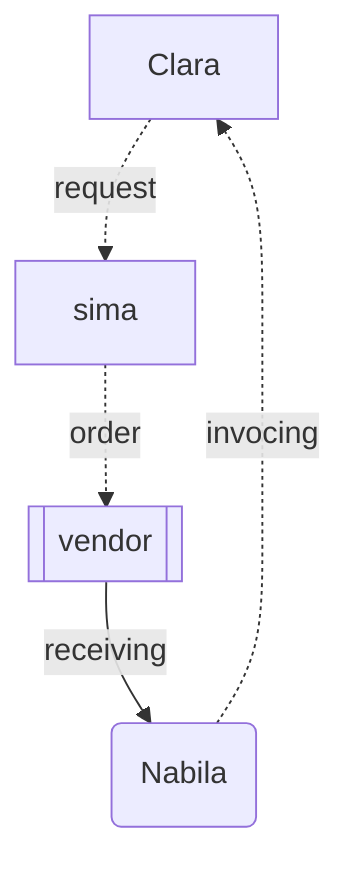
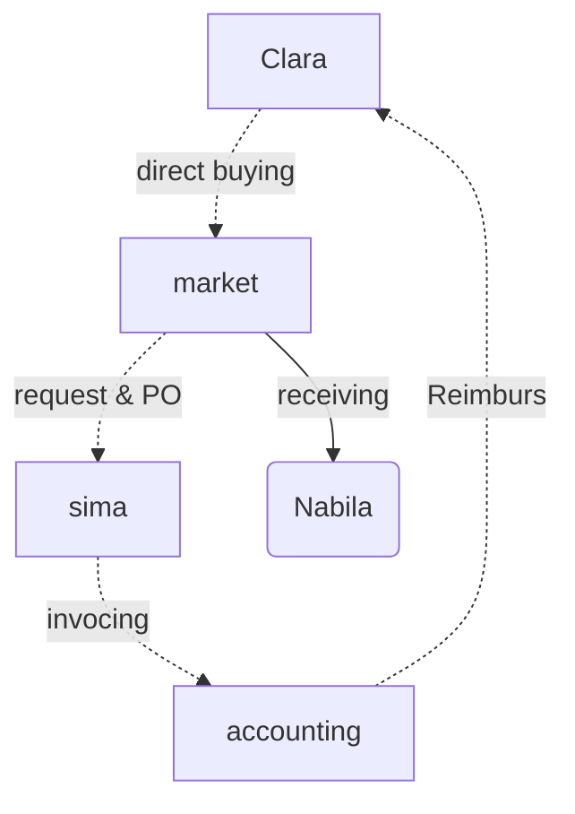

# Pembelian expense

## ALUR 

### GA

**Rule:**

pembelian barang rumah tangga
    * kebutuhan pantri
    * tissue 

ATK

kertas 
      * printer

 ---

* bu_klara request  ke pak sima
* pak sima order ke vendor 
* nabila receive bandingkan dengan order

**request - order - invocing - bayar**

**order - payment - invocing - reimburs**

test
