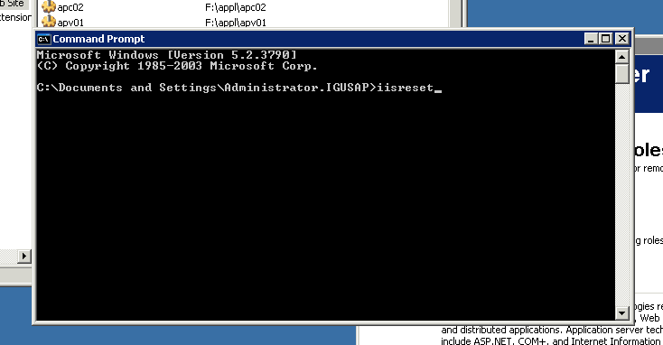
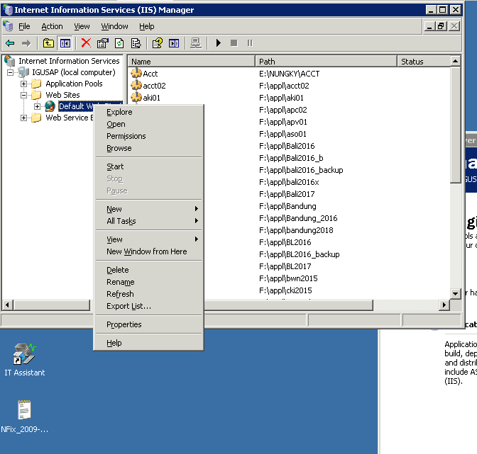
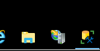
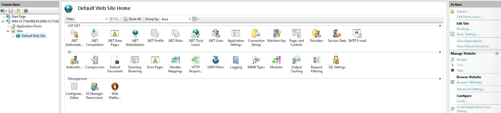
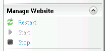
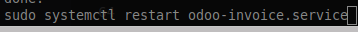
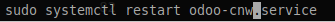

#  Restart Server pendukung SAP

---

### Server Order List

**IP :** 192.168.250.34
**User :**  Administrator
**Password :** a
**Connection :** RDP

**RESTART IIS SERVER**

**Opsi 1** 

* Masuk ke command prompt
    * Ketik " _iisreset_  "

**Opsi 2**

* Masuk ke IIS
    * Click kanan di website
    * Pilih Restart / Stop & Start

**STOP IIS SERVER**
* Masuk ke IIS
    * Click kanan di website
    * Pilih Stop 

---

### Server Web SAP

**IP :** 192.168.250.13
**User :**  Administrator
**Password :** password#01
**Connection :** RDP

**RESTART IIS SERVER**

Internet Information Server -> web site

* Restart Services

---

### Server CNW

**IP :** 192.168.250.14
**User :**  admin
**Password :** admin
**Connection :** SSH
(user Windows untuk login menggunakan Putty)

**RESTART Services**
 

* masuk terminal
    * ketik `sudo systemctl restart odoo-invoice.service`

---

### Server Tally

**IP :** 192.168.250.15
**User :**  admin
**Password :** 19u7@m4it
**Connection :** SSH
(user Windows untuk login menggunakan Putty)

**RESTART Services**
 

* masuk terminal
    * ketik `sudo systemctl restart odoo-cnw.service`

