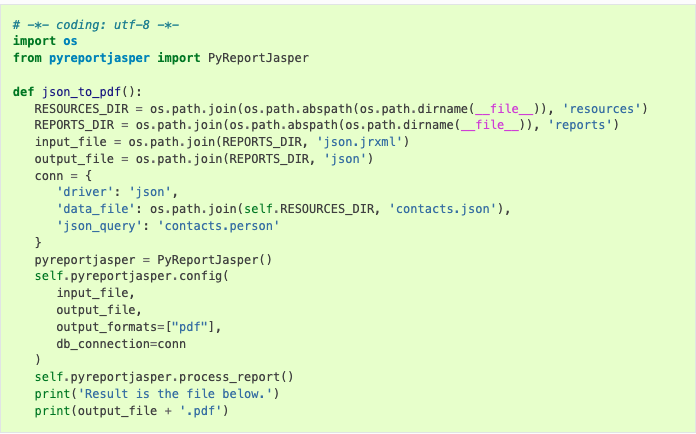

# RESEARCH n DEVELOPMENT
## CNW PROJECT


### A. Report menggunakan jasperReport

* Buat odoo wizard module
* buat generate data menjadi format ```json```
* execute generate pdf  / excel di button odoo 

___sample___
 

_issue_ : saat generate, odoo close ( hang )


### B. extract ZIP file ke dalam folder tertentu

user zip file file faktur pajak hasil generate program DJP. untuk diupload ke program cnw, dan cnw  generate dan sync file faktur pajak dengan invoice di cnw
* User upload file zip ke field binary (odoo binary )
* klik button extract di odoo cnw
* cnw akan extract ke dalam folder sesuai parameter yang di set di program
* klik button ```sync```
* mapping file faktur pajak ke table cnw-invoice


### C. Mapping / mounting QNAP share folder ke server linux

Mapping share folder datasharing( ```//share/sharingaccounting``` ) ke linux (contoh ke /```mnt/share01``` ) secara permanen 

### D. Dynamic filter di context dan domain odoo

Filter dynamic (parameter) dari form wizard ke tree 

parameter : 
* datefrom (optional)
* dateto (required)
* businesspartner (optional)
* balanced (optional)
* arperson (optional)
* item (optional)
* ar group (optional)

form wizard bisa jalan seperti field yang bisa difilter di search tree 


### E. Jinja2 report bisa grouping dan header selalu tampil di page lainnya

