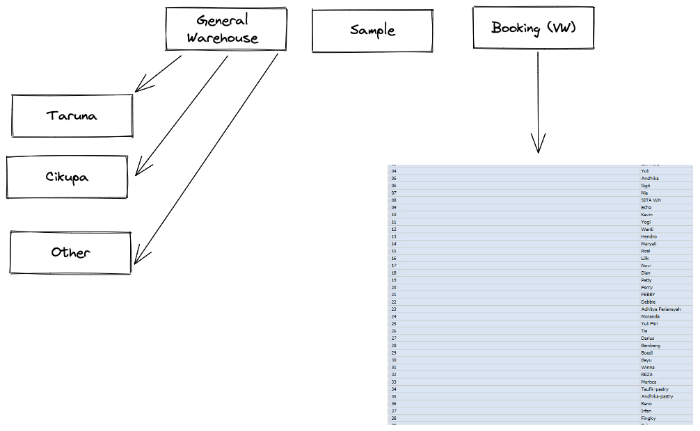
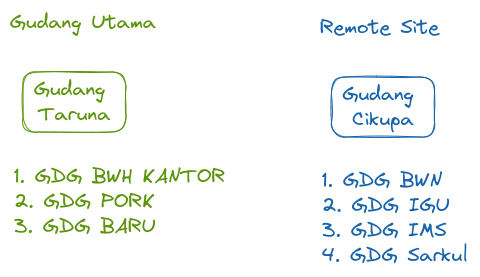
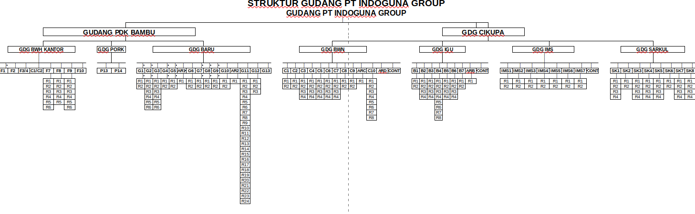
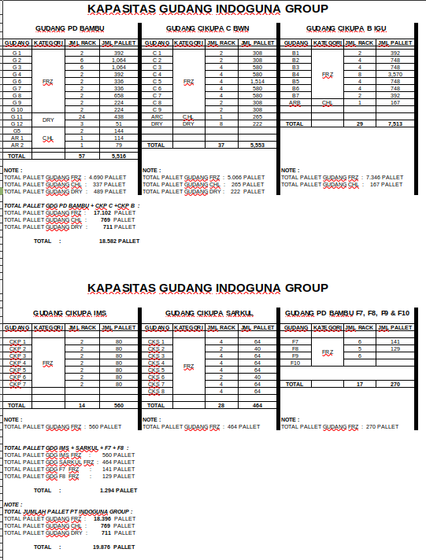
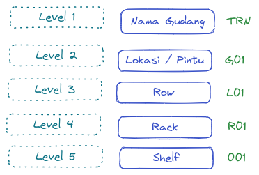
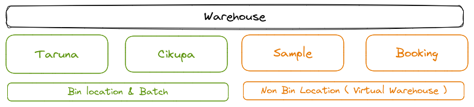
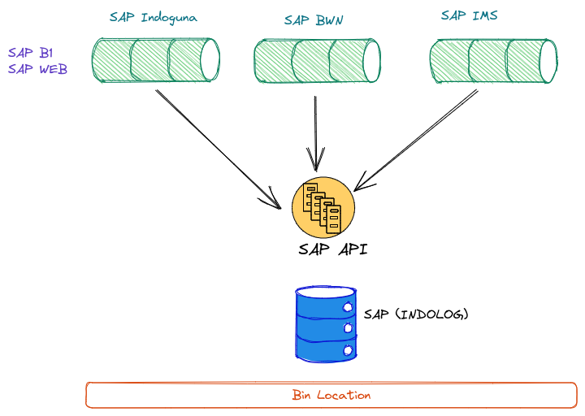
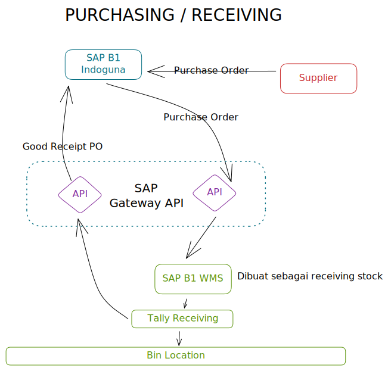
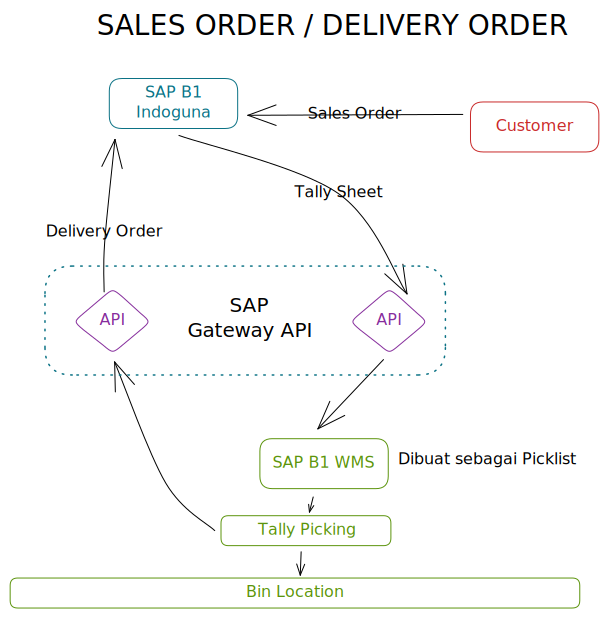

# Integrasi WMS ke SAP 
    Rencana penerapan WMS ke dalam Sistem SAP


## Kondisi Saat Ini ( SAP B1 )

### Pembagian warehouse di sistem SAP

**Gudang di bagi berdasarkan 3 bagian utama**
   * General Warehouse 
   * Sample
     * digunakan untuk penyimpanan Stock sample / free, agar tidak menggangu / merubah perhitungan COGS item
  
   * Virtual warehouse (Booking)
     * Digunakan ```reserve stock``` oleh Sales untuk customer tertentu berdasarkan ```kontrak```





### Pembagian Warehouse dan lokasi

**Gudang Utama dan Remote Site**
    



<br/>



<br/>




<br/>
<div style="page-break-after: always; visibility: hidden">
\pagebreak
</div>


## Implementasi WMS Schema I 

```Bin Location``` di implementasikan di sistem production.


### Tahapan implementasi


**Konfigurasi :** 

* Semua ```Company``` yang menggunakan **warehouse Indoguna** sebagai penyimpanannya disetup ```Bin Location``` dengan struktur yang sama.
  <br/>
    Company yang berkaitan 

  * Indoguna Utama
  * Cahaya Karya Indah
  * Surya Cemerlang Abadi
  * Indo Mandiri Sejahtera
  * Boga Wisesa Nusantara
  * Sarana Kulina Intisejahtera
<br/>
* Struktur Bin Location menggunakan 5 level code 




* Ada warehouse yang di setup Bin location dan ada yang tidak



* Perubahan hardcode untuk **SAP WEB**, terutama modul 
  * SO ( Untuk cek qty )
  * DO ( Pemilihan Bin-Loc dan warehouse )
  * Inventory Transfer ( Pemindahan stock antar warehouse warehouse per bin-loc)
  * Good Receipt dan Good Receipt ( Adjusement Stock)
  * Rebag (Production / potongan )
  * Good Receipt PO ( Penerimaan barang dari PO)
  * PO ( Penambahan fitur bin)

* Penambahan Modul ```Transfer Bin Location```


### Issue

* Semua storage di gudang bersifat share antar company group
* Memungkinkan jual antar beli company, tidak berubah posisi bin-location, tetapi merubah status ```ownership``` dari barang tersebut

### Pro Cons

**PRO**


* tidak menambah database baru


**Cons**


* Merubah ```hardcode``` **SAP WEB**
* Merubah logic program **SAP WEB**
* Merubah konfigurasi semua company yang menggunakan SAP WEB
* Menambah konfigurasi di program CNW
* Susah menerapkan share storage ( 1 warehouse dipakai multi company)

<div style="page-break-after: always; visibility: hidden">
\pagebreak
</div>


## Implementasi WMS Schema II 

```Bin Location``` di implementasikan menggunakan Database Company Baru, tidak menggunakan database yang berjalan sekarang. 

**KONSEP**

DB Company Baru sebagai pemilik gudang, semua company yang menggunakan warehouse statusnya menyewa storage. Antar company group dan WMS berhubungan Melalui _API SAP Service Layer_





```Untuk operasional :``` 

Setiap company membuat PO, WMS akan menarik PO tersebut sebagai draft Receiving di WMS.





<br/>
Setiap company membuat SO, WMS akan menarik SO tersebut sebagai draft Delivery Order di WMS.setelah setelah Picking, akan dikirim kembali ke SAP Company bersangkutan sebagai Delivery Order





### Tahapan implementasi


**Konfigurasi :** 

* Membuat struktur Bin Location berdasarkan lokasi dan Fisik warehouse 
* Struktur Bin Location menggunakan 5 level code 


* Membuat konfigurasi ```API SAP B1``` untuk berkomunikasi antar company yang menggunakan SAP WEB, untuk menghubungkan pengeluaran dan penerimaan stock di SAP masing company dengan Company WMS
  


### Issue

* Memerlukan prosedur (SOP) antar company
* Interfacing antara SAPWEB dan WMS, dan route aplikasi

### Pro Cons

**PRO**


* Tidak Merubah sistem yang ada
* Bisa melokalisir masalah yang timbul
* Tidak mengganggu operasional Admin Office ( Hanya operasional gudang yang berubah dari Excel ke  sistem SAP)
* Untuk multi company yang share warehouse sama, dapat diakomodasi dengan sistem ini.


**Cons**


* Menambah Database baru, company baru, dengan konfigurasi berbeda dengan template distributor
* Menambah logic program **SAP WEB** untuk komunikasi dengan API WMS 
