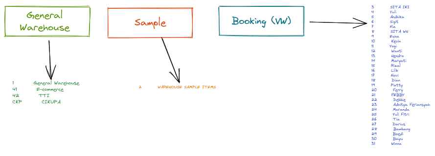

# Integrasi WMS ke SAP 
    Penerapan bin Location Di SAP


## Kondisi Saat Ini ( SAP B1 )

### Pembagian warehouse di sistem

**Gudang di bagi berdasarkan 3 bagian utama**
   * General Warehouse 
   * Sample
     * digunakan untuk penyimpanan Stock sample / free, agar tidak menggangu / merubah perhitungan COGS item
  
   * Virtual warehouse (Booking)
     * Digunakan ```reserve stock``` oleh Sales untuk customer tertentu berdasarkan ```kontrak```





### Prosedur Receiving


**Receiving untuk Gudang Sample**

Saat pembuatan PO sudah dipisahkan berdasarkan _kebijakan dari purchasing_ apakah barang tersebut masuk ke gudang sample atau digabungkan dengan barang yang berjalan ( Pengaruhnya di COGS )


**Receiving untuk Barang Import**
