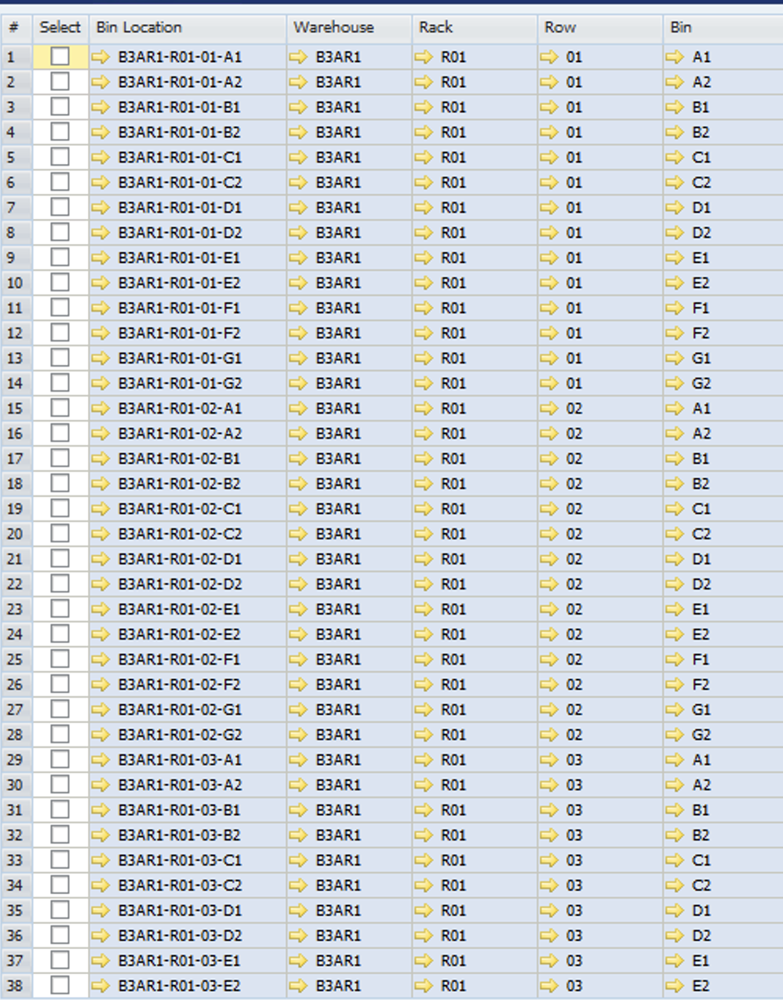

# WMS SAP INDOGUNA
    


## SETUP SAP

**Format Warehouse**

Skema Warehouse Indoguna 

6 level  structure :
 
* Location
* Warehouse
* Gate
* Rack
* Row
* Bin

**[Location]**

| Location | Location Code |
|---|---|
| Gudang IGU  | A |
| Gudang IGU Cikupa | B |
| Gudang Makasar | C |
| Gudang Bandung | D |
| Gudang Jogja | E |
| Gudang Semarang | F |
| Gudang Surabaya | G |
| Gudang Bali | H |
| Gudang Balikpapan | I |
| Gudang Palembang | J |


<br/>

**[warehouse]**

| Warehouse | Warehouse Code |
|---|---|
| Pondok Bambu Gdg Baru | A1 |
| Pondok Bambu Gdg Lama | A2 |
| Pondok Bambu Gdg Pork | A3 |
| Cikupa IGU | B1 |
| Cikupa IMS | B2 |
| Cikupa BWN | B3 |
| Cikupa SARKUL | B4 |
| Gudang Makasar | C1 |
| Gudang Bandung | D1 |
| Gudang Jogja | E1 |
| Gudang Semarang | F1 |
| Gudang Surabaya | G1 |
| Gudang Bali | H1 |
| Gudang Balikpapan | I1 |
| Gudang Palembang | J1 |


**[Gate]**

format code 
* G01 s/d G12
* F01 s/d F20
* ARB - ARD (anteroom )

**[Rack]**

format Code : R01 - R24

**[Row]**

format Code : 01 - 33


**[Bin]**

format Code : A1 - G2

**[Format Code Bin Location]**

Contoh : Pondok Bambu Gdg Baru gate 01 Rack 01 

    A1G01-R01-01-A1
    A1G01-R01-01-A2
    A1G01-R01-01-B1
    A1G01-R01-02-A1
    A1ARB-R01-00-00


Contoh : Palembang gate F02 Rack 02

    J1F02-R02-01-A1
    J1F02-R02-01-A2
    J1F02-R02-01-B1
    J1F02-R02-02-A1
    J1ARC-R00-00-00




**SAP Module**

Modul yang digunakan untuk WMS 

* Good Receipt : Untuk penerimaan barang ke bin location
* Good Issue : Untuk mengeluarkan barang dari bin locatio
* Inventory Transfer : Pindah Antar Bin
* Stock counting ( Posting ) : Update Quantity per bin location


Tambahan ```UDF``` Untuk SAP :

**Good Receipt dan Good Issue**

* Company Consignee : Company Asal barang ( SAP B1 Database )
* BP : Untuk dokumen Receive atau Issue 

    Informasi lain sudah ada di standar UDF

**Bin Location**
* Status Booking


## SETUP CNW-LS WMS

**ODOO-COMPANY SETTING**

Menambahkan Tab baru untuk konfigurasi database SAP WMS

field :
* wns_sap_user : Char
* wms_sap_pass : Char
* wms_sap_db : Char
* wms_sap_sl : URL service Layer WMS

inherit from _res_company_


**CNWLS-WMS**

Membuat modul CNWLS-WMS

Dengan Model utama sebagai berikut : 


* CNWLS_WMS_Location  : Mapping dengan ```Location Table``` di B1
* CNWLS_WMS_Warehouse : Mapping dengan ```OWHS - Warehouse``` B1
* CNWLS_WMS_Gate : Mapping dengan Level 1 Bin location
* CNWLS_WMS_Bin : Mapping dengan bin location SAP B1 
* CNWLS_WMS_Bin_ItemSummary :  Mapping dengan bin location COntent
* CNWLS_WMS_Bin_ItemDetail : Sesuai dengan format Racking saat ini
* 